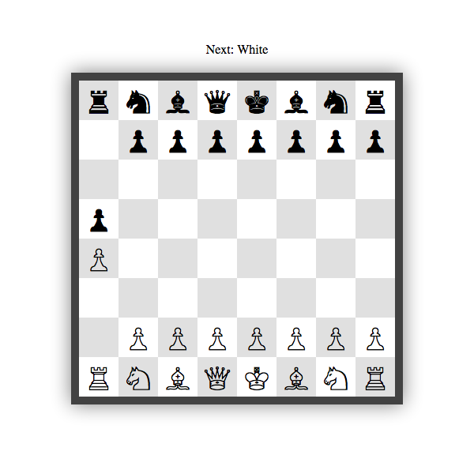

# Vanilla JavaScript Chess Game

This is a JavaScript chess game that creates the GUI and handles the basic logic for moving the pieces on the board. This is not an AI attempt.

[Link](https://pablo-jurado.github.io/JSchess/)

> NOTE: Work in progress.

